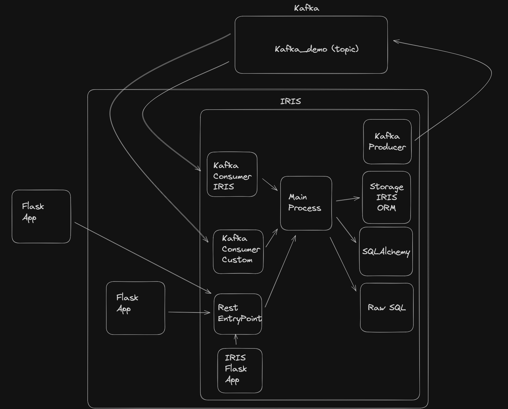
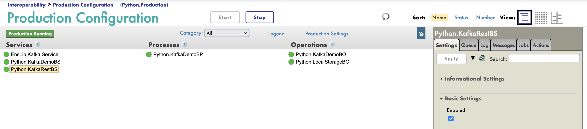
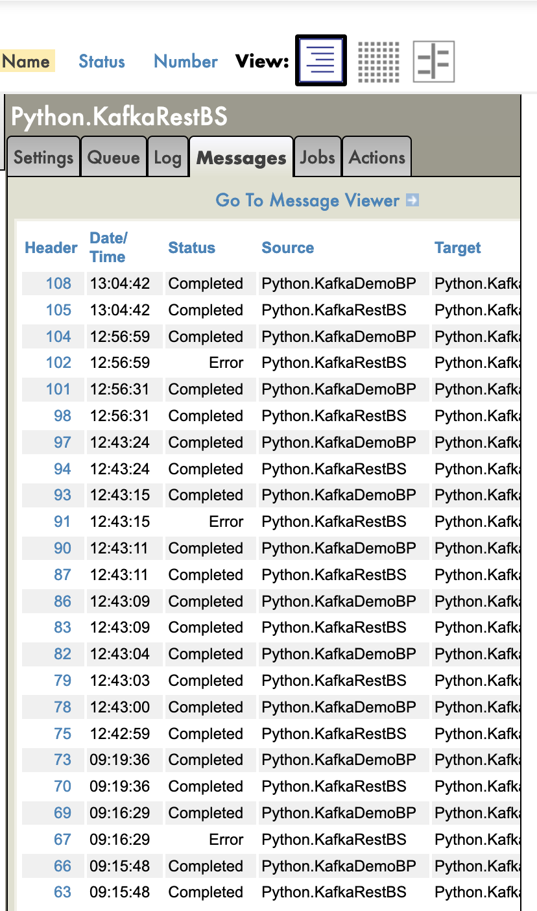

# Iris Kafka demo : Centralized business logic



The aims of this demo are : 
- show how IRIS can be used to centralize business logic
  - data coming from different sources (kafka, rest, etc)
- storing data in IRIS can be done in a variety of ways
  - Using raw sql
  - Using IRIS Orm (%Persistent classes)
  - Using SQLAlchemy
- rest api can be run
  - on IRIS
  - on a separate server

## Architecture

The architecture is composed of 3 parts :

- Kafka
- Wsgi app
- IRIS Storage

All those parts are connected to the same Business Process `Python.KafkaDemoBP`. It's the central point of the demo.

The Business Process `Python.KafkaDemoBP` is the orchestrator of the demo. It receives messages from different sources and sends them to the storage.

The business logic is defined in the Business Process `Python.KafkaDemoBP`.

```python
from iop import BusinessProcess
from kafka_demo.msg import KafkaRawMessage, ProductMessage, ProductSQLMessage, ProductIRISMessage, Product

import random
import json

class KafkaDemoBP(BusinessProcess):

    def on_kafka_raw_message(self, msg: KafkaRawMessage):
        # deserialize the message to a Product
        deserialized_msg = json.loads(msg.value.decode('utf-8'))
        # parse the message to a Product
        product = Product(**deserialized_msg)
        # randomely choose the message type
        message_type = random.choice([ProductMessage, ProductSQLMessage, ProductIRISMessage])
        # send the message to the business operation
        self.send_request_sync('Python.LocalStorageBO', message_type(**product.__dict__))

    def on_iris_kafka_message(self, msg: 'iris.EnsLib.Kafka.Message'):
        # transform the iris message to a KafkaRawMessage
        kafka_message = KafkaRawMessage(msg.value.encode('utf-8'))
        # pass it to the main business process
        self.on_kafka_raw_message(kafka_message)
```

The business logic is simple :

- Deserialize the message
- Parse the message to a `Product` object
- Randomly choose the message type
- Send the message to the business operation `Python.LocalStorageBO`

### Kafka

This demo uses a kafka broker to send and receive messages outside of IRIS.

IRIS is both a kafka producer and a kafka consumer.

#### Kafka producer

The kafka producer is a simple python class that sends messages to a kafka topic.

```python
class KafkaDemoBO(BusinessOperation):
    # simple business operation to process a message to a Kafka topic
    def on_init(self):
        if not hasattr(self, 'topic'):
            # default topic
            self.topic = 'kafka_demo'
        if not hasattr(self, 'kafka_broker'):
            # default Kafka broker
            self.kafka_broker = ['kafka:9092']
        # initialize the Kafka producer
        self.producer = KafkaProducer(bootstrap_servers=self.kafka_broker)

    def on_kafka_test_message(self, msg: KafkaTestMessage):
        # create a json from msg
        message = json.dumps(msg.__dict__).encode('utf-8')
        # send the message to the Kafka topic
        self.producer.send(self.topic, message)
        self.producer.flush()

    def on_tear_down(self):
        # close the Kafka producer
        self.producer.close()
```

Bassicly, the class `KafkaDemoBO` is a business operation that sends messages to a kafka topic.

It's triggered by the `KafkaTestMessage` class.

And this message is serialized as a json bytes and sent to the kafka topic.

#### Kafka consumer

Two consumers are created :
- One using the IRIS Kafka adapter
- One using custom code

This choice is made to show that IRIS can be used to consume kafka messages in different ways.

The implementation of IRIS Kafka adapter returns kafka messages as `strings` when the custom code returns kafka messages as `bytes`.

```python
class KafkaDemoBS(BusinessService):
    @staticmethod
    def get_adapter_type():
        return "Ens.InboundAdapter"

    def on_init(self):
        if not hasattr(self, 'topic'):
            # default topic
            self.topic = 'kafka_demo'
        if not hasattr(self, 'kafka_broker'):
            # default Kafka broker
            self.kafka_broker = ['kafka:9092']
        if not hasattr(self, 'timeout'):
            # default timeout
            self.timeout = '1'
        # initialize the Kafka consumer
        self.consumer = KafkaConsumer(
            self.topic,
            bootstrap_servers=self.kafka_broker,
            group_id='demo-group',
            auto_offset_reset='smallest',
            enable_auto_commit=True,
            consumer_timeout_ms=int(self.timeout) * 1000
        )
        # get the offset
        self.offset = iris.gref("^KafkaDemo.Offset")

    def on_tear_down(self):
        # close the Kafka consumer
        self.consumer.close()

    def on_process_input(self, message_input):
        self.log_info(f"Consuming messages from Kafka topic: {self.topic}")
        # consume messages from the Kafka topic
        for msg in self.consumer:
            # log the message
            self.log_info(f"Received message: {msg.value.decode('utf-8')}")
            # store the offset
            self.offset[self.topic] = msg.offset
            # create a Kafka message
            kafka_message = KafkaRawMessage(msg.value)
            # send the Kafka message to the business process
            self.send_request_async('Python.KafkaDemoBP', kafka_message)
```

The class `KafkaDemoBS` is a business service that consumes messages from a kafka topic.

It creates a `KafkaRawMessage` object from the kafka message and sends asynchronously to the business process `Python.KafkaDemoBP`.

The offset is stored in a global reference `^KafkaDemo.Offset`.

### Wsgi app

Three wsgi servers are created to serve two flask app.

Th two flask apps are the same, the only difference is the wsgi server serving the app.

The flask app is a simple app that receives a post request and sends a `string` to the Business Service `Python.KafkaRestBS`.
The Business Service `Python.KafkaRestBS` creates a `KafkaRawMessage` object and sends it to the Business Process `Python.KafkaDemoBP`.

`app.py` :

```python
from flask import Flask, request, jsonify
from iop import Director

import json

app = Flask(__name__)

bs = Director.create_python_business_service('Python.KafkaRestBS')

@app.route('/kafka', methods=['POST'])
def kafka_demo():
    message = json.dumps(request.get_json())

    try:

        bs.on_process_input(message)

    except Exception as e:
        return jsonify({"message": str(e)}), 500
    return jsonify({"message": "Message sent to KafkaDemoBP"})


if __name__ == '__main__':
    app.run(host='0.0.0.0', port=5000)
```

`app.py` is intantiated in two times, one on IRIS, one with a dedicated wsgi server but on the same container.

`app_standalone.py` :

```python
from flask import Flask, request, jsonify

import intersystems_iris

import json

import os
# Create a connection to InterSystems IRIS
conn = intersystems_iris.connect(
    hostname=os.getenv('IRIS_HOST', 'iris'),
    port=int(os.getenv('IRIS_PORT', 1972)),
    namespace=os.getenv('IRIS_NAMESPACE', 'IRISAPP'),
    username=os.getenv('IRIS_USERNAME', 'SuperUser'),
    password=os.getenv('IRIS_PASSWORD', 'SYS')
)

app = Flask(__name__)

@app.route('/kafka', methods=['POST'])
def kafka_demo():
    message = json.dumps(request.get_json())

    #### Equivalent to Director.create_python_business_service('Python.KafkaRestBS')
    irisInstance = intersystems_iris.IRIS(conn)
    bs = irisInstance.classMethodObject("EnsLib.PEX.Director","dispatchCreateBusinessService","Python.KafkaRestBS")
    #### End of equivalent

    try:

        #### Equivalent to bs.on_process_input(message)
        status = bs.invoke("OnProcessInput",message)
        if status != 1:
            raise Exception("Error processing the message")

    except Exception as e:
        return jsonify({"message": str(e)}), 500
    return jsonify({"message": "Message sent to KafkaDemoBP"})


if __name__ == '__main__':
    app.run(host='0.0.0.0', port=5001)
```

In the `app_standalone.py`, the connection to IRIS is created and the `Python.KafkaRestBS` is instantiated using the `intersystems_iris` package.

### IRIS Storage

The storage is defined by this table :

```sql
CREATE TABLE kafka_demo (
    id INT IDENTITY PRIMARY KEY,
    name VARCHAR(100),
    price DECIMAL(10, 2)
);
```

The storage can be done in different ways :
- Using raw sql
- Using IRIS Orm (%Persistent classes)
- Using SQLAlchemy

#### Raw sql

The raw sql is done using the `sqlachemy` engine.

```python
    def on_product_sql_message(self, msg: ProductSQLMessage):
        with self.engine.connect() as conn:
            # Create your SQL statement with named parameters
            statement = text("INSERT INTO product (name, price) VALUES (:name, :price)")
            # Execute the statement with parameters
            conn.execute(statement, {"name": msg.name, "price": msg.price})
            conn.commit()
```

#### IRIS Orm

The IRIS Orm is done using the `%Persistent` class `Product`.

```python
    def on_product_iris_message(self, msg: ProductIRISMessage):
        product = iris.cls('User.product')._New()
        product.name = msg.name
        product.price = msg.price
        product._Save()
```

#### SQLAlchemy

The SQLAlchemy is done using the `sqlachemy` ORM.

```python
    def on_product_sqlalchemy_message(self, msg: ProductSQLAlchemyMessage):
        product = Product(name=msg.name, price=msg.price)
        self.session.add(product)
        self.session.commit()
```

SQL Alchemy object definition :

```python
from sqlalchemy import Column, Integer, String, DECIMAL
from sqlalchemy.ext.declarative import declarative_base

Base = declarative_base()

class ProductModel(Base):
    __tablename__ = 'product'
    id = Column(Integer, primary_key=True)
    name = Column(String(255), nullable=False)
    price = Column(DECIMAL(10, 2), nullable=False)
```

## How to run the demo

Git clone the repo

```bash
git clone 
```

Run the docker-compose file

```bash
docker-compose up -d
```

## How to test the demo

### Using the rest api

Three endpoints are available :

- http://localhost:53795/flask/kafka
  - wsgi app served by IRIS
- http://localhost:5000/kafka
  - wsgi app running on iris but with a dedicated wsgi server
- http://localhost:5001/kafka
  - wsgi app served by a separate server

Each endpoint should have the same behavior, the only difference is the wsgi server serving the app.

example of a post request :

```bash
curl -X POST http://localhost:53795/flask/kafka -H "Content-Type: application/json" -d '{"name": "test", "price": 10}'
```

You can also generate some data using the kafka producer

```bash
docker-compose exec iris bash
iop --test Python.KafkaDemoBO --classname kafka_demo.msg.KafkaTestMessage --body '{"name": "test", "price": 10}'
```

### See the results in the IRIS Management Portal

You can see the whole process in the IRIS Management Portal :

- Go to the IRIS Management Portal : http://localhost:53795/csp/sys/%25CSP.Portal.Home.zen?$NAMESPACE=IRISAPP
  - Login/Password : SuperUser/SYS
- Go to Interoperability > Configure > Production

You should see the production `Python.Production`



- Click on the `Messages` tab

You should see the messages processed by the production

